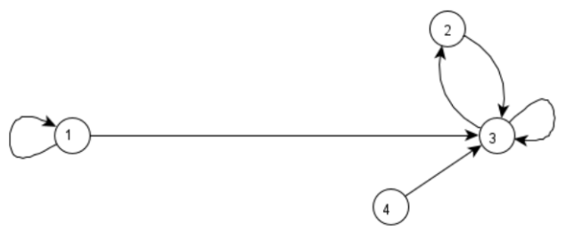

# Activity 1 - Directed Graph
# What to Do
Given the following directed graph:

1. Define the:

$$ G = (V, E) $$

2. Find the `outdegree` and `indegree`:

| Node | Outdegree | Indegree |
| --- | --- | --- |
| 1 | ? | ? |
| 2 | ? | ? |
| 3 | ? | ? |
| 4 | ? | ? |

# When to Do It
Before next week class

# Advice
Base from lesson 2