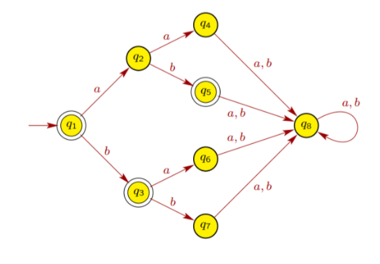

# Activity 3-2 - Finite-State Automata Definition Practice
5 points each

# What to Do
Given by the following automata:

1. What are states (Q)?

   *YOUR ANSWER:*

   $$ Q = ? $$

2. What is the alphabet (Σ)?

   *YOUR ANSWER:*

   $$ \Sigma = ? \ $$

3. What is the start state (q0)?

   *YOUR ANSWER:*

   $$ q_0 = ? $$

4. What are the final states (F)?
   
   *YOUR ANSWER:*

   $$ F = ? $$

5. Write all transitions in this notation:

   $$ T(state, input) \rightarrow next state $$

   *YOUR ANSWER:*

   $$ T(?, ?) \rightarrow ? $$
   
   $$ . $$

   $$ . $$

   $$ . $$

6. Create the transition table.

# When to Submit It
Before next week class

# Advice
Check the examples in lesson 4!