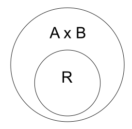
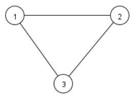
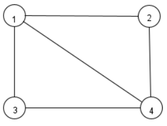
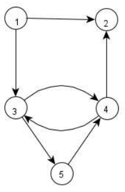

# Lesson 2 - Review on Relation and Graph
## Sets
Set is `collection` of things.

For example, the items you wear: `hat`, `shirt`, `pants`, `watches` and many more.

Another example, is `fingers`.
This includes `index`, `middle`, `ring`, `pinky` and `thumb` finger.

## Notation
To define set, we use the name of the set. In the previous example, we use the word `items`. Then, we write `=` equal sign, followed by open curly braces, inside that we put the elements and close it with curly braces.

$$ items = \lbrace hat, shirt, pants, watches, ... \rbrace $$

We call the `hat`, `shirt`, `pants`, `watches` as an `element` or `member` of a set.

Notice the usage of `ellipsis` (the three dots) representing `and many more`. In this example, we have more `items` we can wear, so we just say there are many more items on set items. In this case, we want to say it is an `infinite` set.

Similarly, the set `fingers` is represented as:

$$ fingers = \lbrace index, middle, ring, pinky, thumb \rbrace $$

But this time, we know fingers is only composed of 5. Thus, we can call this a `finite` set.

Not all usage of ellipsis means an `infinite` set. Let's take an `alphabet` set as an example. We know alphabet has 26 letters. Instead of writing all letters, we can write the letters in the middle as `ellipsis`:

$$ alphabet = \lbrace a, b, c, ... , x, y, z \rbrace $$

Thus, we used `ellipsis` even in a `finite` set.

## Other notation
Let set `A`:

$$ A = \lbrace 1, 2, 3, 4, 5 \rbrace $$

Based on the set above, we can say `1` is an element of `A`. Similary, 2 is also an element of `A`. Using notation we can write:

$$ 1 \in A $$

$$ 2 \in A $$

## Subset
A `subset` is set that exist on another `set`.

Let set `A`:

$$ A = \lbrace 1, 2, 3, 4, 5 \rbrace $$

Let set `X`:

$$ X = \lbrace 1, 2 \rbrace $$

We can say that `X` is a subset of `A`, since the `elements` in `X` are found (exist) in `A`.

What if our X is:

$$ X = \lbrace 1, 2, 3, 4, 5, 6 \rbrace $$

This time, `X` is `not` a subset of `A`, since the `element` 6 does not exist in `A`.

However, reversing it, we found that `A` is a subset of `X`, since the `elements` 1 to 5 are found in `X`.

So, the notation for subset is (if we want to say `X` is a subset of `A`):

$$ X \subseteq A $$

## Rectangular coordinate system
We can draw rectangular coordinate system, as a graph with horizontal line (`x-axis`) and vertical line (`y-axis`).

Let's pick a point: 1 in `x-axis` and -2 in `y-axis`. We can represent this as:

$$ (1, -2) $$

`x-axis` value is on first position and `y-axis` value in second position.

$$ (x, y) $$

Rectangular coordinate system is also called `Cartesian coordinate system`.

## Cartesian product of a sets
Cartesian product of a two set is the set of all ordered pairs `(a, b)` such that `a` belongs to `A` and `b` belongs to `B`.

For example:
Let set `Students` and `Subjects` as:

$$ Students = \lbrace alice, bob, carl \rbrace $$

$$ Subjects = \lbrace automata, intel sys \rbrace $$

Then, their `cartesian product` of `Students` and `Subjects` is:

$$ Students \times Subjects = \lbrace (alice, automata), (alice, intel sys), (bob, automata), (bob, intel sys), (carl, automata), (carl, intel sys) \rbrace $$

> Imagine we are distributing the `Students` to `Subjects` or saying `Students` is taking `Subjects`. For example, `Student` `alice` is taking the Subject `automata`. In this case, the `order` matters or we call this as `ordered pairs`, since we can not say the `Student` `automata` is taking the `subject` `alice`.
 
Using numerical values as an example:

$$ A = \lbrace 1, 2, 3 \rbrace $$

$$ B = \lbrace 10, 20, 30 \rbrace $$

Then, their cartesian product is:

$$ A \times B = \lbrace (1, 10), (1, 20), (1, 30), (2, 10), (2, 20), (2, 30), (3, 10), (3, 20), (3, 30) \rbrace $$

## Relations
A relation is a set of ordered pairs that satisfy a `relationship`.
Thus, we expect that a relation is written as:

$$ R = \lbrace (...,...), (...,...) \rbrace $$

Let set `A` and `B`:

$$ A = \lbrace 5, 2, 3 \rbrace $$

$$ B = \lbrace 1, 3, 2 \rbrace $$

If we want to get the relation between `A` and `B`, then the relation is defined as:

$$ R \subseteq A \times B $$

Where 

$$ A \times B $$

is the cartesian product between those two sets.

### Relationship
But, what do we mean `that satisfy a relationship`?
For example, we define a relationship `A` is greater than `B`:

$$ A > B $$

First we get their cartesian product:

$$ A \times B = \lbrace (5, 1), (5, 3), (5, 2), (2, 1), (2, 3), (2, 2), (3, 1), (3, 3), (3, 2)\rbrace $$

Again, we say that a relation is a subset of ordered pairs (the cartesian product) that satisfy a relationship (A > B).

So, what are the ordered pairs in the cartesian product that satisfy the relationship `A is greater than B`?

The following are the ordered pairs that satisfy the relationship, since the `first` value (5) in `first` pair (5, 1) is greater than `second` value (2).

$$ (5, 1), (5, 3), (5, 2), (2, 1), (3, 1), (3, 2) $$

Thus, the relation of the set `A` and `B` above is simply written as:

$$ R = \lbrace (5, 1), (5, 3), (5, 2), (2, 1), (3, 1), (3, 2) \rbrace $$

> But, what is the connection of the relation to automata? Simply, the relation is the `set of edges`. In this module, we will discuss what do we mean by `edges` and `vertices` in a graph. Also, all concepts discussed so far will be used all throughout this course.

## Graph
### Undirected graph

In a graph, we call the circles as `vertex` or `node`, and the lines as `edges`.

Thus, in the graph above, we can represent the `vertices` as a set:

$$ V = \lbrace 1, 2, 3 \rbrace $$

And `edge` as a `pair`. Note that we didn't say it is an `ordered` pair since, in a `undirected` graph the order does not matter. So we can represent all `edges` as a set of pairs.

$$ E = \lbrace (1, 3), (1, 2), (2, 3) \rbrace $$

Now, formally, we can represent a graph as:

$$ G = (V, E) $$

Where, `V` is set of `vertices` and `E` is set of `edges`. So, to represent the graph above:

$$ G = (\lbrace 1, 2, 3 \rbrace, \lbrace (1, 3), (1, 2), (2, 3) \rbrace) $$

We also have what cell a `degree`. A `degree` of a node is the number of edges connected to that node. So, all `vertices` has a a degree of `2` since each of them has `2` edges connected.

| Node | Degree |
| --- | --- |
| 1 | 2 |
| 2 | 2 |
| 3 | 2 |

Another example of an undirected graph:

$$ G = (\lbrace 1, 2, 3, 4 \rbrace, \lbrace (1, 2), (1, 3), (1, 4), (2, 4), (3, 4) \rbrace) $$

| Node | Degree |
| --- | --- |
| 1 | 3 |
| 2 | 2 |
| 3 | 2 |
| 4 | 3 |

In automata, we will mostly used what we call a `directed` graph or `digraph` for short. `Digraph` has now an arrow or `direction` on the `edges`. So when we represent an `edge` as pair, it should be now an `ordered` pair, the order matters now since the edge is specific to the direction. Usually, what is being pointed is in the second value of an `ordered` pair.

$$ G = (\lbrace 1, 2, 3, 4, 5 \rbrace, \lbrace (1, 2), (1, 3), (3, 4), (4, 3), (3, 5), (5, 4) \rbrace) $$

In `digraph` we have `indegree` and `outdegree`. The `indegree` of a node is the number of edges `pointing in` to that node. While `outdgree` is the number of edges `pointing away` to that node.

| Node | Indegree | Outdegree |
| --- | --- | --- |
| 1 | 0 | 2 |
| 2 | 2 | 0 |
| 3 | 2 | 2 |
| 4 | 2 | 2 |
| 5 | 1 | 1 |

## Summary

| Symbol/Notation | Description |
| --- | --- |
| $\lbrace...\rbrace$ | Sets |
| $\in$ | Element of |
| $\subseteq$ | Subset of |
| $A \times B$ | Cartesian product |
| $R$ | Relations |
| $G$ | Graph |
| $(..,..)$ | Pair |