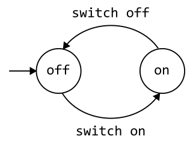
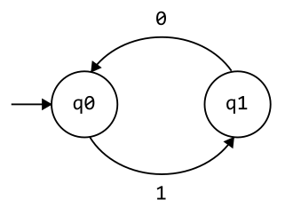

# Lesson 4 - Finite-State Automata Defined
Finite-state automata (sometimes called a finite-state machine) is a computation model that can be implemented with hardware or software and can be 
used to simulate sequential logic and some computer programs. Finite-state automata generate regular languages. It can be used to model problems in many 
fields including mathematics, artificial intelligence, games, and linguistics. 
Finite-state automata are the simplest computational models for computers with extremely limited amount of memory. From a mathematical perspective, finite-state automaton is a finite collection of states with transition rules that take you from one state to another that occur given an input.

A finite-state automaton consists of 5 tuple of objects:

$$ (Q, \Sigma, \delta, q_0, F)$$

Specifically:
| Symbol / Notation | Description |
| --- | --- |
| $Q$ | Finite set called the **states** |
| $\Sigma$ | Finite set called the **alphabet** or input |
| $f: Q \times \Sigma$ | Transition function |
| $q_0 \in Q$ | Initial / start state |
| $F \subseteq Q$ | Final / accept states |

Finite-state automata can be represented in two ways:
1. Transition diagram
2. Transition table

## Transition diagram
Previously, we had a preview of an example of simple on-off switch model:

Let's try to simplify or represent it mathematically:

> States `off` and `on` became `q0` and `q1`, while `switch off` and `switch off` became `0` and `1`.

Then we can write the automaton above as:

$$ Q = \lbrace q_0, q_1 \rbrace $$

$$ \Sigma = \lbrace 0, 1 \rbrace $$

$$ q_0 = q_0 $$

> The initial state `q0` happens to be the state `q0`.

$$ F = \lbrace {\emptyset} \rbrace $$

> We didn't defined any final state in this automaton.

For transitions, we can represent them as a set of ordered pairs:

$$ \delta: Q \times \Sigma = \lbrace (first), (second), ... \rbrace $$

For example, the following are the two transitions 
represented as ordered pairs:

$$  ((current state, input), next state) $$

So, for the automaton of on-off switch:

$$  ((q_0, 1), q_1) $$

> q0 inputs 1, then went to q1

$$  ((q_1, 0), q_0) $$

> Similarly, q1 inputs 0, then went to q0

Finally, from this:

$$ \delta: Q \times \Sigma = \lbrace (first), (second), ... \rbrace $$

To this:

$$ \delta = \lbrace ((q_0, 1), q_1),   ((q_1, 0), q_0) \rbrace $$

We can also use this notation for transition:

$$ T(q_0, 1) \rightarrow q_1 $$

$$ T(q_1, 0) \rightarrow q_0 $$

So, when we say find T(q0, 1), the answer is q1.

## Transition table
| State | 0 | 1 |
| --- | --- | --- |
| $q_0$ | - | $q_1$ |
| $q_1$ | $q_0$ | - |

## Second example:

$$ Q = \lbrace q_1, q_2, q_3 \rbrace $$

$$ \Sigma = \lbrace 0, 1 \rbrace $$

$$ q_0 = q_1 $$

> This time, our start state is labeled as `q1`. So we say our `q0` or `initial state` is `q1`.
> 

$$ F = \lbrace {q_2} \rbrace $$

> Also noticed the state with two circle. Two circles in the diagram represents the `final` or `accepting` state. In this diagram, we only have 1 final state, but we can have 1 or more final state; that's why it's represented as set, because we can set of final states defined.
 
$$ \delta = \lbrace ((q_1, 0), q_1),   ((q_1, 1), q_2), ((q_2, 1), q_2), ((q_2, 0), q_3), ((q_3, 1), q_2) \rbrace $$

OR:

$$ T(q_1, 0) \rightarrow q_1 $$

$$ T(q_1, 1) \rightarrow q_2 $$

$$ T(q_2, 1) \rightarrow q_2 $$

$$ T(q_2, 0) \rightarrow q_3 $$

$$ T(q_3, 1) \rightarrow q_2 $$

## Transition table
| State | 0 | 1 |
| --- | --- | --- |
| $q_1$ | $q_1$ | $q_2$ |
| $q_2$ | $q_3$ | $q_2$ |
| $q_3$ | - | $q_2$ |

Finite-state automata has two types, which will be discussed in detail in the next module:
1. Deterministic finite-state automata (DFA)
2. Non-deterministic finite-state automata (NDFA)
   
## **Summary**
| Symbol / Notation | Description |
| --- | --- |
| $Q$ | Finite set called the **states** |
| $\Sigma$ | Finite set called the **alphabet** or input |
| $f: Q \times \Sigma$ | Transition function |
| $q_0 \in Q$ | Initial / start state |
| $F \subseteq Q$ | Final / accept states |
