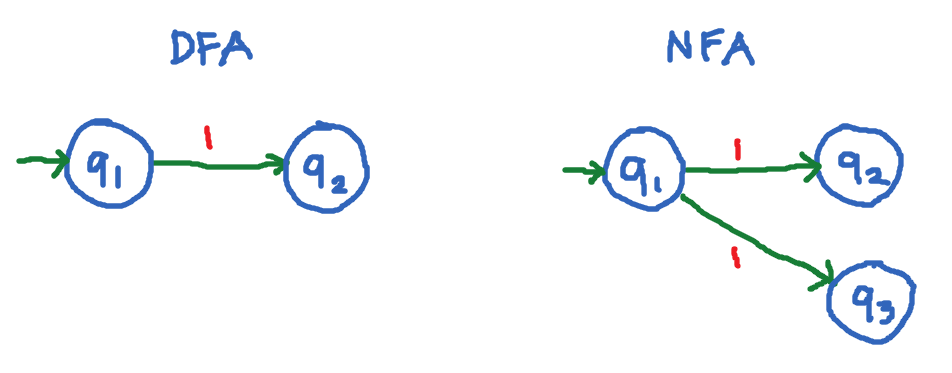
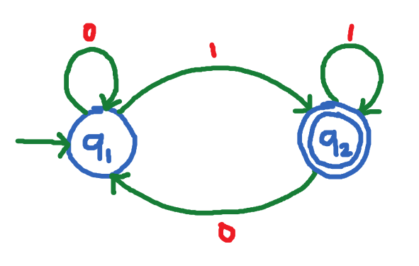
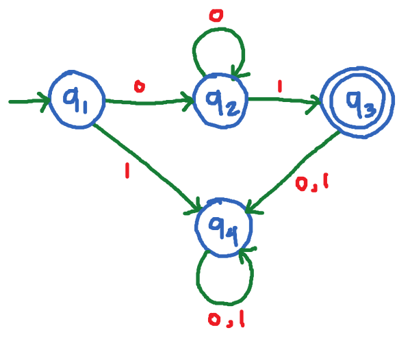

# Lesson 5 - Deterministic Finite Automata (DFA)

A `deterministic finite automata (DFA) `is a finite-state machine that accepts or rejects a given string of symbols or characters, by running or parsing them through a state sequence uniquely determined by the string. The term `deterministic` refers to the fact that each string, and thus each state sequence, is unique. In DFA, there is one and only one state in which the automata can be.

It is a five (5) tuple that consists of the following:

| Symbol / Notation | Description |
| --- | --- |
| $Q$ | Finite set called the **states** |
| $\Sigma$ | Finite set called the **alphabet** or input |
| $f: Q \times \Sigma$ | Transition function |
| $q_0 \in Q$ | Initial / start state |
| $F \subseteq Q$ | Final / accept states |

DFA consists of:
1. A finite set of **states** (Q). Example:

$$ Q = \lbrace A, B, C, ... \rbrace $$

$$ Q = \lbrace S1, S2, S3, ... \rbrace $$

$$ Q = \lbrace 1, 2, 3, ... \rbrace $$

$$ Q = \lbrace q_0, q_1, q_2, ... \rbrace $$

2. An **input alphabet** (Σ). Example:

$$ \Sigma = \lbrace 0, 1 \rbrace $$

$$ \Sigma = \lbrace a, b, c \rbrace $$

3. A **transition function** (δ: Q x Σ -> Q). This is the transition from one state 
to another given an input. Example:

$$ \delta: q_1 \times 0 \rarr q_2 $$

OR

$$ T(q_1, 0) \rarr q_2 $$

4. A **initial/start state** (q0). Example:

$$ q_0 = q_1 $$

$$ q_0 = A $$

$$ q_0 = S1 $$

5. A set of final states (F). Final or accepting states are represented by a **double circle**. Example:
   
$$ F = \lbrace q_2 \rbrace $$

$$ F = \lbrace q_2, q_3 \rbrace $$

## Simple difference between DFA and NFA

In DFA, the state `q1` has only 1 outgoing transition for the input `1`. Thus, the term `deterministic` means we are sure what next state it will go next: just to `q1`.

In NFA, the state `q1` has 2 outgoing transition for the input `1`. Thus, the term `non-deterministic` means we are not sure what next state it will go next: either `q2` or `q3`.

## Example 1

This is an example of DFA that accepts all strings that end in 1 such as:

$$ 01, 101, 11, 1011, 111, ... $$

State of sequences for the following strings accepted by the given DFA:

| String | Transitions | Accepted? |
| -- | -- | -- |
| $w = 01$ | $q_1 \rarr q_1 \rarr q_2$ | Accepted |
| $w = 101$ | $q_1 \rarr q_2 \rarr q_1 \rarr q_2$ | Accepted |
| $w = 11$ | $q_1 \rarr q_2 \rarr q_2$ |  Accepted |
| $w = 111$ | $q_1 \rarr q_2 \rarr q_2 \rarr q_2$ |  Accepted |
| $w = 1011$ | $q_1 \rarr q_2 \rarr q_1 \rarr q_2 \rarr q_2$ |  Accepted |
| $w = 0$ | $q_1 \rarr q_1 \rarr q_1$  | Rejected |
| $w = 10$ | $q_1 \rarr q_2 \rarr q_1$ | Rejected |

> We say that a string is `accepted` if the last state is one of the final states, otherwise it is `rejected`. In the last two strings: `0` and `10`, the transition doesn't end with one of the final states `q2`. Therefore they are rejected.

Also, the `Language` of this automaton is:

> L = set of all strings that ends with 1

## Example 2

This is an example of a DFA that accepts all strings starting with one or more 0’s and ends in 1.

State sequences for the following strings accepted by the given DFA:

| String | Transitions | Accepted? |
| -- | -- | -- |
| $w = 01$ | $q_1 \rarr q_2 \rarr q_3$ |
| $w = 001$ | $q_1 \rarr q_2 \rarr q_3$ |
| $w = 0001$ | $q_1 \rarr q_2 \rarr q_3$ |
| $w = 00001$ | $q_1 \rarr q_2 \rarr q_3$ |
| $w = 0101$ | $q_1 \rarr q_2 \rarr q_3 \rarr q_4 \rarr q_4$ |
| $w = 011$ | $q_1 \rarr q_2 \rarr q_4$ |

> Similarly, the last two strings: `0101` and `011` ends with state `q4` (which is not one of the final states: `q3`). Thus, they are also rejected.

The `Language` of this automaton is:

> L = set of all strings that starts with one or more 0’s and ends in 1.