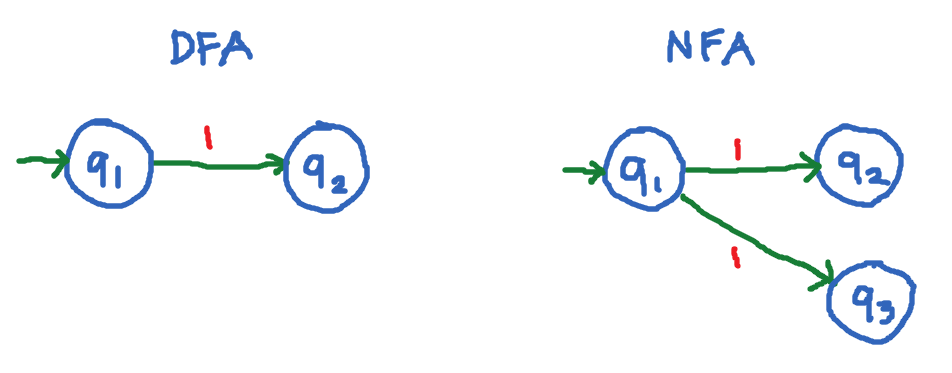
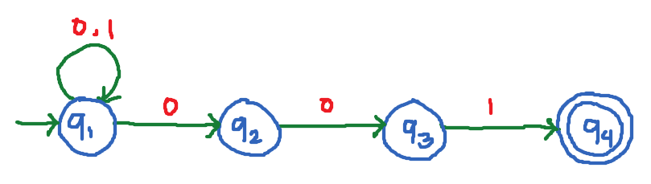
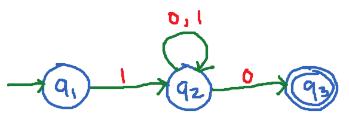
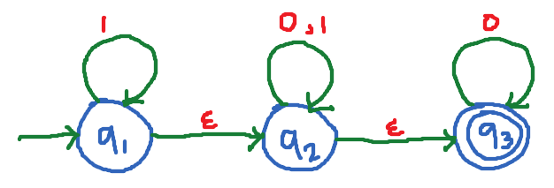

# Lesson 6 - Non-Deterministic Finite Automata (NFA)

`Non-deterministic finite automata` refer to machines can exist in multiple 
states at the same time.

NFA also consistsa five (5) tuple:

| Symbol / Notation | Description |
| --- | --- |
| $Q$ | Finite set called the **states** |
| $\Sigma$ | Finite set called the **alphabet** or input |
| $f: Q \times \Sigma$ | Transition function |
| $q_0 \in Q$ | Initial / start state |
| $F \subseteq Q$ | Final / accept states |

## Simple difference between DFA and NFA

In DFA, the state `q1` has only 1 outgoing transition for the input `1`. Thus, the term `deterministic` means we are sure what next state it will go next: just to `q1`.

In NFA, the state `q1` has 2 outgoing transition for the input `1`. Thus, the term `non-deterministic` means we are not sure what next state it will go next: either `q2` or `q3`.

## Example 1

Construct an NFA over Σ = {0, 1} that will accept strings that end in `001`. Or NFA with Language:

> L = set of all strings that end in `001`

| String | Accepted? |
| -- | -- |
| $w = 001$ | Accepted |
| $w = 0001$ | Accepted |
| $w = 1001$ | Accepted |
| $w = 1011$ | Rejected |
| $w = 00$ | Rejected |

This is how we should write the transition table for NFA:

## Transition table
| State | 0 | 1 |
| --- | --- | --- |
| $q_1$ | $\lbrace  q_1, q_2 \rbrace$ | $\lbrace q_1 \rbrace$ |
| $q_2$ | $\lbrace q_3 \rbrace$ | - |
| $q_3$ | - | $\lbrace q_4 \rbrace$  |
| $q_4$ | - | - |

> Note that states in NFA are now represented as `sets`.

NFA also starts in one initial state. And each state can have zero, one or more outgoing transitions labeled with the same input symbol. One difference of the NFA with that of DFA is that the transition function in NFA can go to several states, that is, several choices may exist for the next state at any point.

In this automaton, the state `q1` can transition into two states with the input `0`: either `q1` or `q2`.

Suppose we want to try the following input string of `101001` from the given NFA in example 1, will the given input string be accepted? Let us read each input symbol in sequence: 

1. We start with `q1` as it is our initial state. This makes `q1` an active state. Upon reading `1` in `q1`, it either remains in `q1`. This will keep `q1` as the active state. 
2. Upon reading `0` (next symbol in the input string `101001`) at `q1` which is the active state, it either remains at `q1` or transitions to `q2`. `q1` and `q2` now becomes the active states. 
3. Upon reading the next symbol in the input string which is `1` at `q1`, it remains at `q1`, or upon reading it at the other active state which is `q2`, NFA aborts. Active states are still the `q1` and `q2`. 
4. Upon reading the next input symbol from the input string which is `0` at one active state `q1`, it remains at `q1`, or transitions to `q2`. Upon reading `0` in the other active state which is `q2`, it transitions to `q3`. The active states now are `q1`, `q2` and `q3`. 
5. Upon reading the next input symbol from the input string which is `0` at one active state `q1`, it remains at `q1`, or transitions to `q2`. Upon reading `0` in the other active state which is `q2`, it transitions to `q3`. The active states now are `q1`, `q2` and `q3`. 
6. Upon reading the last input symbol `1` taking into consideration the active states `q1`, `q2`, `q3`, at `q1` it remains at `q1`, at `q2` NFA aborts, at `q3` it transitions to `q4`. The active states now are `q1` and `q4`.

If at the end of the input symbol, one of the active states is the final state, then the NFA accepts the input string. Thus, in our example, the input string is accepted since one of the active states is the final state which is `q4`.   

## More examples of NFA are as follows.

> L = set of all strings that starts with 1 and ends with 0

| String | Accepted? |
| -- | -- |
| $w = 10$ | Accepted |
| $w = 100$ | Accepted |
| $w = 1010$ | Accepted |
| $w = 101$ | Rejected |
| $w = 01$ | Rejected |

> In string `01` we see that `q1` has no input for `0`, we can simply say that the state `dies` or `aborts` so it is also rejected.

## Transition table
| State | 0 | 1 |
| --- | --- | --- |
| $q_1$ | - | $\lbrace q_2 \rbrace$ |
| $q_2$ | $\lbrace q_2, q_3 \rbrace$ | $\lbrace  q_2 \rbrace$ |
| $q_3$ | - | -  |
## NFAs with ε transitions (null transitions)

`ε-transition` is a transition from one state to another state without 
consuming any additional input symbol.

`ε-NFAs` are those NFAs with atleast on explicit `ε-transition` defined.

## ε-NFA version of the example automaton above

> L = set of all strings that starts with 0 and ends with 1

## Transition table
| State | 0 | 1 | ε |
| --- | --- | --- | --- |
| $q_1$ | - | $\lbrace q_1 \rbrace$ | $\lbrace q_2 \rbrace$ |
| $q_2$ | $\lbrace q_2 \rbrace$ | $\lbrace q_2 \rbrace$ | $\lbrace q_3 \rbrace$ |
| $q_3$ | $\lbrace q_3 \rbrace$ | - | - |