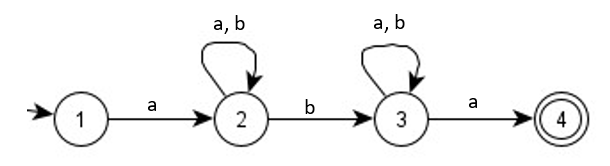
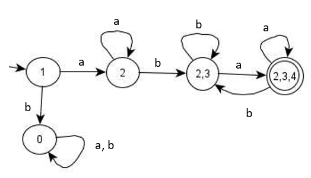

# Lesson 7 - DFA and NFA Equivalence 

## Differences between DFA and NFA

Before we proceed with DFA and NFA Equivalence, let us review of the differences between the DFA and NFA.

| DFA | NFA |
| --- | --- |
| Each transition leads to exactly one state | A transition could lead to a number of states  |
| Transition on all possible input symbols should be defined in every state  | Not all input symbols need to be defined explicitly in every state |
| Accepts the input string if the last transition ends in the final/ accept state | Accepts the input string if one of the active states for the last input symbol is the final/ accept state |
| Sometimes difficult to construct because of the number of states | Generally easier to design than a DFA to construct and may have fewer states |

## Converting NFA to DFA

The class of languages accepted by NFA’s includes the languages accepted by DFA’s. Note that automata are equivalent if they accept the same language.

*Theorem: Let L be a set accepted by an NFA.*

*Then there exists a DFA that accepts L.*

A DFA can be converted to an equivalent NFA accepting the same language ( (set of input strings), likewise, every NFA can be converted into a DFA that accepts the same language.

## **Example**

Let us try converting the above NFA to DFA through the use of transition table.

**Step 1.** Let us convert the diagram to its equivalent transition table.

| States | a | b |
| --- | --- | --- |
| $\rarr$ 1| 2 | - |
| 2 | 2 | 2, 3 |
| 3 | 3, 4 | 3 |
| $*$ 4 | - | - |

*Note: Right arrow denotes "initial state" while asterisk denotes "final state*

**Step 2.**
Base on the table in `Step 1`, we start with state `1` (initial state) for every input. The next state will be based on the transition state on the previous state. In this case, we have state `2`. So, from state `2`, we put the transition for every input. The procedure will be repeated until all transition states are declared as states.

| States | a | b |
| --- | --- | --- |
| $\rarr$ 1| 2 | - |
| 2 | 2 | 2, 3 |
| 2, 3 | 2, 3, 4 | 2, 3 |
| $*$ 2, 3, 4 | 2, 3, 4 | 2, 3 |

**Step 3.**
Convert the transition table to its equivalent transition diagram for the final DFA. The final state shall be that which has the final which is state 4.  

