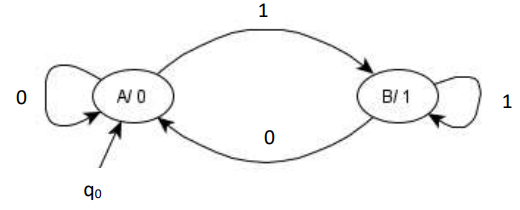
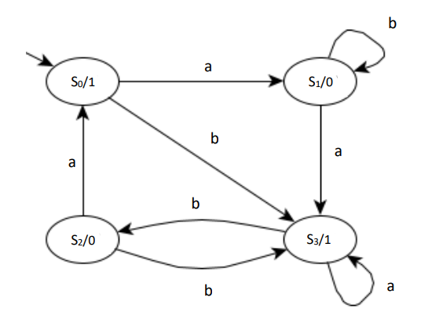
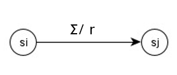
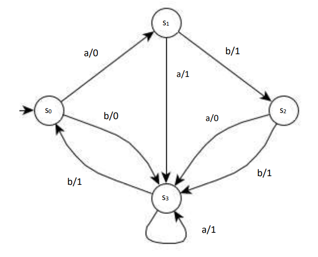
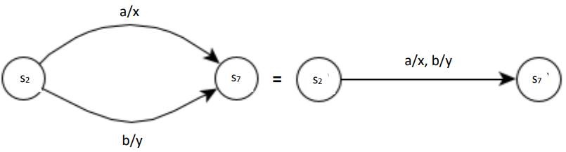

# Lesson 8 - Finite-State Automata with Output 

We will now produce two machines similar to deterministic finite automata, but this time, producing an output.

Moore and Mealy machines can help simulate string output simulation. They also used diagrams and tables to help in tracking output strings. 

## Moore machine
| Symbol / Notation | Description |
| --- | --- |
| $Q$ | Finite set called the **states** |
| $\Sigma$ | Finite set called the **alphabet** or input |
| $r$ | Finite set called the **alphabet of output characters** |
| $f: Q \times \Sigma \rarr Q$ | Transition function |
| $g: Q \times \Sigma \rarr r$ | Output function |
| $q_0 \in Q$ | Initial / start state |

As with the finite state automaton, we shall illustrate the Moore machine using a finite state diagram. 

## Example 1

In Moore machine, the circle that represents the state does not only include the state label, but it also specifies the output printed by that state.

In the operation of a Moore machine, the output is first produced using the output function g before the transition function f is used to read the input and change states.

Imitating the deterministic automaton, the Moore machine reads each element of a string `w` until it has read the entire string. During this process, it produces output consisting of a string of characters of `r`. Since the Moore machine produces output before the first input character is read and produces output from the last state reached before the transition function tries and fails to read input, the output string contains one more character than the input string.

A Moore machine does not define language of accepted words, since in every input, it produces an output and no final state. The processing is just terminated when it reaches the last input string and the last output is printed.

## Example 2

Let us trace the operation of this machine with an input string `abbabb`, with the 
following table:

| Input | | a | b | b | a | b | b |
| --- | --- | --- | --- | --- | --- | --- | --- |
| **State** | $s_0$ | $s_1$ | $s_1$ | $s_1$ | $s_3$ | $s_2$ | $s_3$ |
| **Output** | 1 | 0 | 0 | 0 | 1 | 0 | 1 |

The output string is `1000101` for the input string `abbabb`.

## Mealy Machine
The Mealy machine also contains an output function however, the input is an edge rather than a state. Since the edge depends on the state and the input, the output function reads a state and input and print the output, and we shall denote it as: 

## Example 3

Let us trace the operation of this machine with an input string `aaaabb`, with
the following table:

| **State** | $s_0$ | $s_1$ | $s_3$ | $s_3$ | $s_3$ | $s_0$ | $s_3$ |
| --- | --- | --- | --- | --- | --- | --- | --- |
| Input | a | a | a | a | b | b |  |
| **Output** | 0 | 1 | 1 | 1 | 1 | 0 |  |

The output string is `011110` for the input string `aaaabb`.

Notice that in Mealy machine the output string has the same number of characters as the input string. The Mealy machine does not define a language, so it 
has no final states.

 Take note also that the following may be done in designing/constructing a Mealy machine. 

 