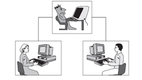
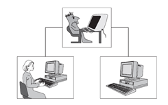

# Lesson 1 - Overview on Artificial Intelligence
## What is ```intelligence```?
Let us look at the dictionary definition.
1.	Someone’s intelligence is their ability to understand and learn things.
2.	Intelligence is the ability to think and understand instead of doing things by instinct or automatically.

In the first definition, intelligence is a quality possessed by humans. In the second however, it is not specific whether someone or something can think and understand. This definition is more flexible and can be viewed as a different approach. But the very core of this term is on thinking and understanding things which humans are capable of. But the very question is can computers think, or can be intelligent?

## What is ```Artificial Intelligence```
Artificial intelligence or ```AI``` is way of making computers, a software or computer-controlled robot think intelligently. Artificial Intelligence is accomplished on how humans learn, decide and work while trying to solve a problem, then using the outcomes of these observations as basis in developing software and systems. So with the question can machines think? The answer is not definite as ```yes``` or ```no``` but rather a fuzzy one.  People do not respond in answering problems. Some people are smarter in some ways than others. Some may deal with problems or situation and make decisions intelligently and others commit mistakes. As humans, we all can learn and understand, to make decisions: however, our abilities are not the same. Therefore, we may expect that machines can certainly think, some may be smarter than the others in some way.

## Goals of ```AI```
The primary goal of ```AI``` is to implement human intelligence in machines. Specifically, make machines answer problems and do things that would require intelligence done by humans. 

## Disciplines Important to ```AI```

| Name  | Description |
| ------------- | ------------- |
| Computer Science  |  Foundation of computer systems are built using algorithms.  |
| Psychology | Since AI mimics on how human think, it is important to understand on how people behave and perceive and on how human process information and represent knowledge. |
| Neuroscience | Helps in emulating human intelligence and is used to build neural networks that mimics brain structure. | 
| Biology | Biology is often used as an inspiration to AI because it aims to create approximative models of human brain. |
| Mathematics | Fundamental topics in math such as linear algebra, calculus, probability, and optimization are important in AI. |
| Philosophy | The concept of logic, methods of reasoning, language and foundation of learning are essential in stablishing on how the computers will rationalize. |

## Milestones in ```AI```
| Year  | Milestone / Innovation |
| ------------- | ------------- |
| 1923 | Karel Čapek’s play named “Rossum's Universal Robots” (RUR) opens in London, first use of the word "robot" in English |
| 1943 | Foundations for neural networks laid. |
| 1945 | Isaac Asimov, a Columbia University alumni, coined the term ```Robotics```.  |
| 1950 | Alan Turing introduced Turing Test for evaluation of intelligence and published ```Computing Machinery and Intelligence```. Claude Shannon published ```Detailed Analysis of Chess Playing``` as a search.  |
| 1956 | John McCarthy coined the term ```Artificial Intelligence```. Demonstration of the first running ```AI``` program at Carnegie Mellon University.  |
| 1958 | John McCarthy invents ```LISP``` programming language for ```AI```. |
| 1964 | Danny Bobrow's dissertation at MIT showed that computers can understand natural language well enough to solve algebra word problems correctly. |
| 1965 | Joseph Weizenbaum at MIT built ```ELIZA```, an interactive problem that carries on a dialogue in English.   |
| 1969 | Scientists at Stanford Research Institute Developed ```Shakey```, a robot, equipped with locomotion, perception, and problem solving. |
| 1973 | The Assembly Robotics group at Edinburgh University built ```Freddy```, the Famous Scottish Robot, capable of using vision to locate and assemble models.  |
| 1979 | The first computer-controlled autonomous vehicle, ```Stanford Cart```, was built.  |
| 1985 | Harold Cohen created and demonstrated the drawing program, ```Aaron```. |
| 1990 | Major advances in all areas of AI:<ul><li>Significant demonstrations in machine learning</li><li>Case-based reasoning</li><li>Multi-agent planning</li><li>Scheduling</li><li>Data mining, web crawler</li><li>Natural language understanding and translation</li><li>Vision, virtual reality</li><li>Games</li></ul>|
| 1997  | The ```Deep Blue Chess Program``` beats the then world chess champion, Garry Kasparov. |
| 2000 | Interactive robot pets become commercially available. MIT displays ```Kismet```, a robot with a face that expresses emotions. The robot Nomad explores remote regions of Antarctica and locates meteorites. |
| 2007 | ImageNet, a large database of annotated images designed to aid in visual object recognition software research. |

## What can ```AI``` do today
| Technology / Task  | Examples |
| ------------- | ------------- |
| Robotic vehicles | Self-driving cars, drones, planes etc. |
| Legged locomotion | BigDog, Spot, Atlas etc. by BostonDynamics |
| Autonomous planning and scheduling | NASA’s Mars rovers, Uber, Google Maps |
| Machine translation | Language translation in over 100 languages |
| Speech recognition | Alexa, Siri, Cortana, and Google Assistant |
| Recommendations | Amazon, Facebook, Netflix, YouTube |
| Game playing | Chess (Deep Blue), GO (AlphaGO), DOTA 2 (OpenAI) |
| Image understanding | Image captioning: AI describing images |
| Computer vision | Face detection & recognition, image classification, object detection  |
| Medicine | Disease diagnosis (COVID-19, Cancer, Alzheimer’s) |
| Climate science | Detailed information about weather events |

## Risks of ```AI```
| Technology / Task  | Examples |
| ------------- | ------------- |
| Lethal autonomous weapons | Homing missiles, killer drones. |
| Surveillance and persuasion | CCTV monitoring, social media.
| Biased decision making | Loan applications biased race, gender, etc. |
| Employment/Jobs | Replacing of a standard worker. |
| Safety-critical applications | Self-driving cars (fatal accidents). |
| Cybersecurity | AI-powered malicious cyberattacks: blackmail, phishing. |
| Super AI | Robots dominating humans in the future. |

## Turing Test
But how can we differentiate humans from machines, and how can we gauge if the machine does emulate human thinking? To do so, we have the ```imitation game``` as proposed by ```Alan Turing```. Turing test is composed of two phases.

<br>



**First Phase:** The interrogator, a man, and a woman are placed in a separate room that can only connect via a neutral medium. The interrogator’s objective is to identify who is the man and woman by asking questions. The objective of the man is to deceive the interrogator that he is a woman, while the woman needs to convince the interrogator that she is a man. 

<br>



**Second Phase:** The man is replaced by a computer program having the aim to deceive the interrogator. If the computer was able to fool the interrogator as the man did. It may be regarded that the computer program passed the intelligent behavioral test.

What makes the Turing test universal? Since humans and machines are connected using terminals (which prevents bias as compared to if the human can see the machine), it gives a standard view of intelligence.