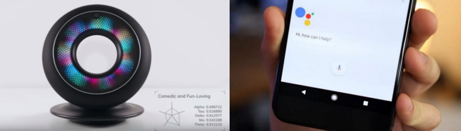
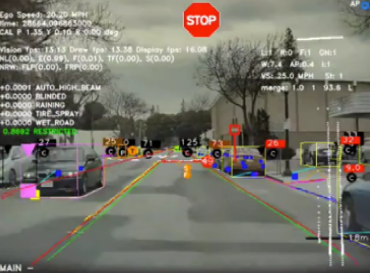

# Lesson 3 - Application of Intelligent Systems

Intelligent systems play an important role in shaping our daily lives and future. We may not be aware of it, but it has been affecting our decisions and lifestyles every day. This lesson focuses on the different examples of intelligent systems and how these technologies are being applied.

## Intelligent Assistants

Intelligent personal assistants can provide services and perform tasks based on user input and awareness. These applications can access online resources such as weather, location, contacts, and many more. In our smartphones, the most common intelligent assistants are Google Assistant, Siri, and Cortana. They usually accept commands as either text or audio inputs. In smart homes, some employ Amazon, Alexa or Google Home. Recently, a similar assistant called Olly was designed to have an evolving personality. Olly can understand a user’s facial expressions, voice inflections, and verbal patterns to proactively start conversations and make pertinent suggestions.

## Healthcare

With the introduction of AI-powered machines, it’s become a bit easier to detect disease and diagnosis. Moreover, it’s also playing a significant role in making the treatment and management processes more simplified. As a result, hospitals and healthcare centers are fast embracing AI-enabled technologies to facilitate everything from research to the detection of diseases.

AI-enabled virtual assistants are reducing unnecessary hospital visits and giving nurses 20% of their time back in the process; workflow assistants are helping doctors free up 17% of their schedules; pharmaceutical companies are researching life-saving medicines in a fraction of the time and cost it traditionally takes, and AI is even being used to help bring healthcare to underdeveloped nations. Some intelligent systems help pathologists analyze tissue samples and make more accurate diagnoses. The aim is to not only improve diagnostic accuracy, but also treatment. The Pager app allows any user to chat with a nurse via text 24/7, talk to a doctor via video chat and have prescriptions filled as needed.

Using technology based on convolutional neural networks, Atomwise's algorithms can "extract insights from millions of experimental affinity measures and thousands of protein structures to predict the binding of small molecules to proteins."

## Smart Cars and Drones

Intelligent systems are a computer-based approach to decision-making. Notably, they are used in autonomous transportation systems and interact with the world in a way that helps humans get from point A to point B safely. Transportation companies like Tesla have made so much progress that we already have a fleet of semi-automatic cars on the road.

## Robotics

AI-powered robots are capable of solving problems and "thinking" in a limited capacity even without natural general intelligence. Smart homes usually employ robotic vacuums that can scan the room size and remember the most efficient routes for cleaning. We also have humanoid robots, one of the most prominent that exists is Sophia, which can have immediate applications as media personalities in movies and TV shows, entertainment animatronics in museums and theme parks, and for university research and medical training applications.

## Energy Efficiency

Another application of intelligent systems is making technology more energy efficient. For example, machine learning can take advantage of energy usage data, the weather, and room occupancy to more efficiently heat and cool homes. Overall, these systems minimize wasted energy, while keeping homes more comfortable.

## Social Media Feeds

If you are using social media, most of your decisions are being impacted by artificial intelligence. From the feeds that you see in your timeline to the notifications that you receive from these apps, everything is curated by AI. AI takes all your past behavior, web searches, interactions, and everything else that you do when you are on these websites and tailors the experience just for you. The sole purpose of AI here is to make the apps so addictive that you come back to them again and again, and I am ready to place a bet that AI is winning this war against you.

## Music and Media Streaming Services

Another great example of how AI impacts our lives are the music and media streaming services that we are using daily. These systems can recommend songs and videos based on your taste. 

## Online Ads Network

One of the biggest users of artificial intelligence is the online ad industry which uses AI to not only track user statistics but also serves our ads based on those statistics. Without AI, the online ad industry will just fail as it would show random ads to users with no connection to their preferences whatsoever. AI has become so successful in determining our interests and serving us ads that the global digital ad industry has crossed 250 billion US dollars with the industry projected to cross the 300 billion mark in 2019. So next time when you are going online and see ads or product recommendations, know that AI is impacting your life.

## Security and Surveillance

While we can all debate the ethics of using a broad surveillance system, there’s no denying the fact that it is being used and AI is playing a big part in that. Humans can't keep monitoring multiple monitors with feeds from hundreds if not thousands of cameras at the same time.

Whether we are using our smartphones, surfing the internet, buying products online, using navigation, wasting time on social media, or listening to songs on our favorite music streaming service, AI is impacting our choices in one way or another.