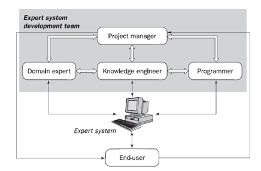
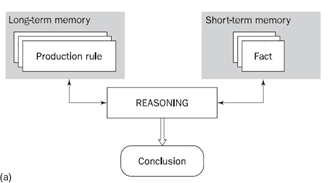
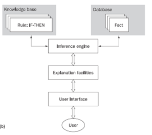

# Lesson 5 - Rule-Based Systems

The human mental process is too complex to represent in an algorithm. However, experts can express their knowledge in the form of rules and problem-solving. To fully understand how we can translate it to a real-life example, say you are to teach a kid to cross the road. How would you do this? 

The first is you create a certain rule for the kid. You explain that he can only cross the road safely when the traffic light is green and must stop when the traffic light is red. Your basic rule can be formulated following simple statements:

```
IF the 'traffic light' is green
THEN the action is to go
IF the 'traffic light' is red
THEN the action is stop
```

The `IF-THEN statements` are called `production rules`. A rule provides some description of how to solve a problem.

Any rule consists of two parts:
```
IF: antecedent (premise or condition)
THEN: consequent (conclusion or action)
```

The basic syntax of the rule is:
```
IF <antecedent>
THEN <consequent>
```

## Rule as a knowledge representation technique
In general, we can have multiple antecedents (premises or conditions) with the use of `conjunctions (AND)`, `disjunctions (OR)`, or a combination of both. Here is the syntax:
```
IF <antecedent 1>
AND <antecedent 2>
	-
	-
AND <antecedent n>
THEN <consequent>
```

```
IF <antecedent 1>
OR <antecedent 2>
	-
	-
OR <antecedent n>
THEN <consequent>
```

The antecedent of a rule incorporates two parts: an object (linguistic object) and its value and it is joined using an operator. For expert systems, they represent objects numerically and is joined using mathematical operators. For example:  
```
IF GPA >= 2.0
AND all grades >= 2.0
THEN 'can avail scholarship'
```
There are five rule representations according to Durkin (1994) namely relations, recommendations, directives, strategies, and heuristic.
1. **Relation**
    ```
    IF the ‘fuel tank’ is empty
    THEN the car is dead
    ```
2. **Recommendation**
    ```
    IF the season is autumn
    AND the sky is cloudy
    AND the forecast is drizzle
    THEN the advice is 'take an umbrella'
    ```
3. **Directive**
    ```
    IF the car is dead
    AND the 'fuel tank' is empty
    THEN the action is 'refuel the car'
    ```
4. **Strategy**
    ```
    IF the car is dead
    THEN the action is 'check the fuel tank';
    step1 is complete
    IF step1 is complete
    AND the 'fuel tank' is full
    THEN the action is 'check the battery';
    step2 is complete
    ```
5. **Heuristic**
    ```
    IF the spill is liquid
    AND the 'spill pH' < 6
    AND the 'spill smell' is vinegar
    THEN the 'spill material' is 'acetic acid'
    ```

## The main players in the expert system development team
For us to develop an expert system - a computer program that is capable performing at a level of human expect at limited problem domain, we need work with the development team which includes the domain expert, the knowledge engineer, the programmer, the project manager and the end-user.



1. **Domain Expert**

    Since a rule-based system needs correct rules, then it must be provided by a human expert. It is essential that this person can solve the problems of that specific domain. Since rules will come from the knowledge of this person, he or she must be able to communicate the knowledge.

2. **Knowledge Engineer**

    This person designs, builds and tests the expert system. He/she is responsible in transferring the knowledge to an expert system. He/she interviews the domain expert and observes and generalize on how the domain expert solves problems and how to represent them into the system. He is also responsible in selecting the algorithms and tools to be used in the project. Furthermore, testing and revisions will still be the responsibility of the knowledge engineer. 

3. **Programmer**

    This person is responsible for transferring the domain knowledge into a language that the computer can understand. He/she will also be a part in the testing phase together with the knowledge engineer.

4. **Project Manager**

    Keeps the project on track. Interacts with all of the members of the team and make sure that all deliverables are met. 

5. **End User**

    The actual user of the expert system developed. They will dictate the success of the system based on their satisfaction and it meets the need of the targeted user.

## Structure of a rule-based system
1. **Production model**

    It is based on the idea that humans are solving problems based on their knowledge. Production rules are stored in long-term memory and problem-specific facts are stored in a short-term memory.

    

2. **Rule-based expert system**
   
    The knowledge base stores domain knowledge (rules) useful in problem-solving each rule has the `IF` (condition) `THEN` (action). The Database holds a set of facts used to match the rules stored in the knowledge base. The inference engine gives a reason for why the system reaches its solution. The explanation facility enables the user to ask why a conclusion is reached and why specific fact is needed.

    

## Advantages of rule-based expert systems
1. **Natural knowledge representation**
   
    Since experts usually solve problems in a manner that if a situation arose, then they do a certain action. This scenario can be represented naturally using an `IF-THEN` production rule. 

2. **Uniform structure**
   
    Production rules are an independent set of knowledge that is represented by a uniform `IF-THEN` structure. They can be independently self-documented.

3. **Separation of knowledge from its processing**
   
    Since the knowledge base is separated from the inference engine, the knowledge may be used in multiple applications in which it may apply.

## The disadvantage of a rule-based expert system
1. **Opaque relations between rules**
   
    Individual production rules have their pros and cons. Production rules are independent and simple, its logical interaction to all the sets of rules may be opaque. It does not show hierarchal knowledge and how rules are connected to come up with an overall strategy
    
2. **Ineffective search strategy**

    Large rule-based systems applied on a real-time application are not advisable because the search for a production rule is exhaustive. It is not a problem if the production rules are just a few but as it grows, the system also becomes inefficient.

3. **Inability to learn**
   
    Unlike a human who can learn new knowledge based on new experiences, a rule-based system can only respond based on the knowledge it stores. It cannot adapt and modify its knowledge unless the knowledge engineer adds new rules or modify existing rules.