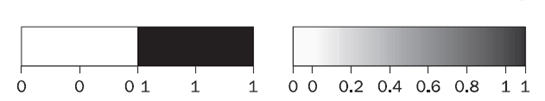
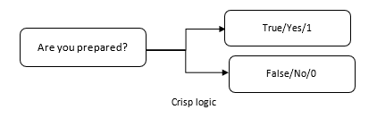
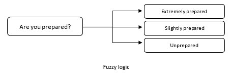
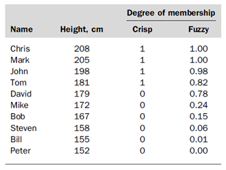
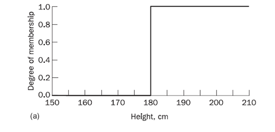
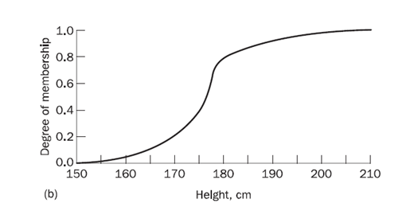

# Lesson 6 - Fuzzy Expert Systems
We can translate a problem domain into a rule-based system if the answer is definite. However, humans sometimes solve problems using thresholds. Sometimes, the answer is definite and follows a certain value to tell whether it is acceptable or not. As an example, a pastry chef assesses the taste of the macaroons. In this problem, it is not answerable by Yes or No but can be answered: “slightly on the sweet side”. For humans, it is easy for us to understand, but for computers, it may be hard to interpret and convert it to rules. Can we represent this type of problem?

## What is fuzzy logic?
Fuzzy logic is a logic that is used to describe fuzziness. It is used to calibrate vagueness. People may understand vague terms like slightly or extremely, those with certain degrees but computers can’t. So with the use of fuzzy logic, it is set to calibrate this vagueness. It is based on the idea that all things admit degrees. Temperature, the color of the skin brightness, speed, beauty - all come into a sliding scale. In degrees, there is no definite distinction.

For Boolean logic or crisp logic, there is a sharp distinction between members and non-members of the class. We can draw a line to separate the two. For example, we can distinguish whether your grade is passed or failed using a 75 mark as our criterion. Grades equal to 75 or higher means passed otherwise failed. But how can we draw a line to say whether you are tall or small. We say John is tall because he is 181 cm. If we set 180 as our standard of tall and values below are considered small, we would find Dave who is 179 as small. Is Dave small or we have just set an arbitrary line?

With the use of fuzzy logic, this can be represented because it reflects on how people think. It attempts to model our common sense and decision-making. 

Fuzzy logic is determined as a set of mathematical principles for knowledge representation based on degrees of membership. It is multivalued. It uses the continuum of logical values ranging from 0 (completely false) to 1 (completely true). Instead of black and white (for binary logic), it employs a spectrum of colors (fuzzy logic). 

Let us investigate the succeeding diagram to differentiate crisp logic from fuzzy logic.

## Crisp vs Fuzzy Logic
To visualize the difference between fuzzy and crisp logic, let us look at the diagram as shown below.  In crisp logic, with a given question or problem, the answer to the question could only be either Yes/No. It has a strict boundary of True or False and no values in between. Fuzzy logic, on the other hand, does have degrees, and the boundary was set with a degree of membership.

## Fuzzy Sets
In the previous subjects, you were introduced to sets. Let `X` be a set with `x` elements. We can then say that an element x either belongs `(x ∈ X)` or does not belong to `X`. This set theory imposes a sharp boundary which gives a set value of 1 for those members of set `X` and 0 for elements that are not a part of the set.

The idea of fuzzy set theory is that an element to a fuzzy set with a certain degree of membership may be partly true.

**Example:** Tall men

Suppose we have Mark at 205 cm tall is given a degree of 1 and Peter, 152 cm, and given with a degree of 0. If we are using the crisp set, we are drawing a line at 180 cm and all men from 179 below are considered small. This does not fully describe the set that we have. But if we are going to look at the fuzzy set. Men in between Mark and Peter are intermediate which can be described as partly tall.  If we are going to represent it using a graph.

## Pratical application of Fuzzy Logic
In our everyday life, we can encounter machines that use fuzzy logic systems. Some of which are presented on the table.

| Product | Fuzzy logic application |
| --- | --- |
| Washing machine | Washing machines can determine the correct amount of detergent, water level, and spin cycle based on the load amount.  |
| Television | Television has brightness control depending on the light present in the room. |
| Rice cooker | Rice cooker uses a fuzzy logic algorithm that alerts the machine to turn the heat up or down depending on the moisture sensed by the machine. |
| Dishwasher | Fuzzy logic is used in adjusting the cleaning cycle based on the load amount of the dishes. |
| Anti-lock brakes on automobiles | Uses fuzzy logic on control brakes in a hazardous situation. The brake will depend on the speed and acceleration. |
| Palmptop computer | This type of computer can recognize handwritten characters and translate them to the nearest character. |
| Elevator control | Based on passenger traffic in the elevator, the waiting time is adjusted. |
| Copy machine | Using for adjusting drum voltage based on picture density, humidity, and temperature. |

## Advantages of Fuzzy Logic Systems
1. The structure of Fuzzy Logic Systems is easy and understandable. 
2. Fuzzy logic is widely used for commercial and practical purposes because it helps in controlling machines and consumer products. Home appliances, cars, and office machines commonly use fuzzy logic controls which are useful in our everyday life. 
3. It may not offer accurate reasoning just like crisp logic, but it may offer acceptable reasoning. 
4. It provides the most effective solution to complex issues. 

## Disadvantages of Fuzzy Logic Systems
1. Fuzzy logic is not always accurate. The results are perceived only based on assumption. There is no standard that fuzzy systems follow so it may not be widely accepted. 
2. Validation and Verification of a fuzzy knowledge-based system need extensive testing with hardware. It is computationally expensive. 
3. Setting exact, fuzzy rules and, membership functions is a difficult task. 
4. Some fuzzy time logic is confused with probability theory and the terms.

