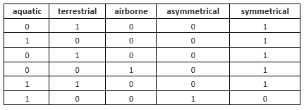

# Lesson 7 - Data Mining
Data mining has attracted a great deal of attention in the information industry and society in recent years. The wide availability of huge amounts of data and the imminent need for turning such data into useful information and knowledge.

Data Mining is a set of methods that applies to large and complex databases. This is to eliminate the randomness and discover the hidden `pattern`. As these data mining methods are almost always computationally intensive. We use data mining tools, methodologies, and theories for revealing patterns in data. There are too many driving forces present. And this is the reason why data mining has become such an important area of study.

Data mining is about solving problems by analyzing data already present in databases. Suppose to take a well-worn example, the problem is fickle customer loyalty in a highly competitive marketplace. A database of customer choices, along with customer profiles, holds the key to this problem. Patterns of the behavior of former customers can be analyzed to identify distinguishing characteristics of those likely to switch products and those likely to remain loyal.  Once such characteristics are found, they can be put to work to identify present customers who are likely to jump ship. This group can be targeted for special treatment, treatment too costly to apply to the customer base.

A `dataset` is a collection of related sets of information that is composed of separate elements but can be manipulated as a unit by a computer. The input takes the form of instances, attributes, and class. The information that the learner is given takes the form of a set of `instances`. Let us take the sample dataset shown below in the next table.

The dataset is used to predict whether users will play based on the current weather. In this example, the class to be predicted is `Play`. In this case, there are two classes to be predicted: `Play (Yes)` and `Pay (No)`.

The attributes include `Outlook`, `Temperature`, `Humidity`, and `Windy`. There are also 14 instances included in the dataset. The data: `Sunny-hot-high-false-no` is regarded as one instance.

## Nature of Datasets
| Name | Description |
| --- | --- |
| Quantitative | Measurements or counts, recorded as numerical values, e.g. Height, Temperature, # of Red M&M’s in a bag. |
| Qualitative | Group or categories |
| Ordinal | Possesses a natural ordering, e.g. Shirt sizes (S, M, L, XL) |
| Nominal | Just name of the categories, e.g. Marital Status, Gender, Color of M&M’s in a bag |

There are publicly available datasets that can be freely downloaded for your data mining projects. Here is a substantial article where to get these:

> https://www.dataquest.io/blog/free-datasets-for-projects/

## Data Mining and Ethics
The use of data—particularly data about people—for data mining has serious ethical implications, and practitioners of data mining techniques must act responsibly by making themselves aware of the ethical issues that surround their application.

When applied to people, data mining is frequently used to discriminate—who gets the loan, who gets the special offer, and so on. Certain kinds of discrimination— racial, sexual, religious, and so on—are not only unethical but also illegal. However, the situation is complex: Everything depends on the application. Using sexual and racial information for medical diagnosis is certainly ethical but using the same information when mining loan payment behavior is not. Even when sensitive information is discarded, there is a risk that models will be built that rely on variables that can be shown to substitute for racial or sexual characteristics.  For example,  people frequently live in areas that are associated with particular ethnic identities, and so using a zip code in a data mining study runs the risk of building models that are based on race—even though racial information has been explicitly excluded from the data.

**Anonymization**

To remove identifying information so that the source cannot be known. Anonymization is vital especially for sensitive data experiments, such as covid positive cases, healthcare information, and the like. 

**Reidentification**

Recent work in what is being called reidentification techniques has provided sobering insights into the difficulty of anonymizing data. Publicly available datasets must not contain information that can identify the respondents of the experiments. It is widely accepted that before people decide to provide personal information they need to know how it will be used and what it will be used for,  what steps will be taken to protect its confidentiality and integrity, what the consequences of supplying or withholding the information are, and any rights of redress they may have.  Whenever such information is collected, individuals should be told these things—not in legalistic small print but straightforwardly in plain language they can understand.

Let us take the sample dataset in the next table as an example. The table includes the information of carnapping incidents with their respective fields. This would be a dead giveaway of the victims’ personal information, which violates a lot of ethical considerations. To anonymize the data, it is best to remove personal information to protect the privacy rights of an individual. 

**Why do we preprocess the data?**

Many factors determine the usefulness of data such as accuracy, completeness, consistency, timeliness. The data has to be of quality if it satisfies the intended purpose. Thus, preprocessing is crucial in the data mining process. The major steps involved in data preprocessing are explained below.

For this example, we will use the sample dataset below:

1. **Data Cleaning**

    Data cleaning is the first step in data mining. It holds importance as dirty data if used directly in mining can confuse procedures and produce inaccurate results.

    This step involves the removal of noisy or incomplete data from the collection. Many methods that generally clean data by themselves are available, but they are not robust.

    The sample dataset is deemed to be **noisy** which means, a couple of data cleaning techniques must be done. Let us examine our inputs as we go along.

    This step carries out the routine cleaning work by:

    1. **Fill the Missing Data:**
    
        Missing data can be filled by methods such as:
        - Ignoring the tuple.
        - Filling the missing value manually.
        - Use the measure of central tendency, median or
        - Filling in the most probable value.

    2. **Remove the Noisy Data:** Random error is called **noisy data**.

        Methods to remove noise are:
        
        **Binning**. Binning methods are applied by sorting values into buckets or bins. Smoothening is performed by consulting the neighboring values.

        Binning is done by smoothing by bin i.e. each bin is replaced by the mean of the bin. Smoothing by a median, where each bin value is replaced by a bin median. Smoothing by bin boundaries i.e.  The minimum and maximum values in the bin are bin boundaries and each bin value is replaced by the closest boundary value.

        **Identifying the Outliers.** a data point on a graph or in a set of results that is very much bigger or smaller than the next nearest data point.

    **Resolving Inconsistencies**
    
    Given the sample dataset, we can identify certain problem areas.

    

    - The `Date` attribute is inconsistent. For this problem, we can choose only one format and transform our inputs.
    - The `5th` instance has missing values. For non-numerical values, we can fill it up with the most probable value. For this example, we can place the incident in `Binondo` since this is the most frequent location in the dataset.
    - The `4th instance` is an outlier since the dataset only must include `carnapping cases`. So, for this problem, we can just remove this instance
    - The `Victim` attribute has ethical issues on privacy. This attribute may not be needed for the class to be predicted so it is best to be deleted.
  
    After the initial cleaning, the dataset is transformed into: 

    

2. **Data Integration**

    When multiple heterogeneous data sources such as databases, data cubes, or files are combined for analysis, this process is called data integration. 

    This can help in improving the accuracy and speed of the data mining process.

    Different databases have different naming conventions of variables, causing redundancies in the databases. Additional Data Cleaning can be performed to remove the redundancies and inconsistencies from the data integration without affecting the reliability of data.

    For our sample dataset, the weather may be needed. Since this is not available in the raw dataset, we can search for the weather using the date and location in sites like Accuweather, which stores weather data based on time and place. 

    

3. **Data Reduction**
   
    This technique is applied to obtain relevant data for analysis from the collection of data. The size of the representation is much smaller in volume while maintaining integrity. Data Reduction is performed using methods such as Naive Bayes, Decision Trees, Neural networks, etc.

    Some strategies of data reduction are:

    - **Dimensionality Reduction:** Reducing the number of attributes in the dataset.
    - **Numerosity Reduction:** Replacing the original data volume with smaller forms of data representation.
    - **Data Compression:** Compressed representation of the original data.

    For our sample dataset, the location attribute can be reduced to district and city to attain consistency.

    

4. **Data Transformation**
   
    In this process, data is transformed into a form suitable for the data mining process. Data is consolidated so that the mining process is more efficient, and the patterns are easier to understand. Data Transformation involves Data Mapping and code generation process.

    Strategies for data transformation are:

    - **Smoothing:** Removing noise from data using clustering, regression techniques, etc.
    - **Aggregation:** Summary operations are applied to data.
    - **Normalization:** Scaling of data to fall within a smaller range.
    - **Discretization:** Raw values of numeric data are replaced by intervals. For example, `Age`.

5. **Data Mining**
   
    Data Mining is a process to identify interesting patterns and knowledge from a large amount of data. In these steps, intelligent patterns are applied to extract the data patterns. The data is represented in the form of patterns and models are structured using classification and clustering techniques.

    Three different styles of learning appear in data mining applications.

    - **Classification Learning:** The learning scheme is presented with a set of classified examples from which it is expected to learn a way of classifying unseen examples. An example of the application of classification is the identification of spam messages. A classifier, given a dataset of spam instances, can predict incoming messages as spam or not.

        
        
    - **Association Learning:** Any association among features is sought, not just ones that predict a particular class value. In clustering, groups of examples that belong together are sought.

        One interesting result of association learning is the beer and nappie story. Walmart discovered through data mining that the sales of diapers and beer were correlated on Friday nights. It determined that the correlation was based on working men who had been asked to pick up diapers on their way home from work. On Fridays, the men figured they deserved a six-pack of beer for their trouble, hence the connection between beer and diapers. By moving these two items closer together, Wal-Mart reportedly saw the sales of both items increase geometrically.
    
    - **Numeric Prediction:** The outcome to be predicted is not a discrete class but a numeric quantity.

        An example of a numeric prediction problem is forecasting the sales of a particular product or the yield of agricultural produce. These types of problems usually predict a class with a numerical value. 
    
    > Regardless of the type of learning involved, we call the thing to be learned the `concept` and the output produced by a learning scheme the `concept description`.

    Classification learning is sometimes called `supervised` because, in a sense, the method operates under supervision by being provided with the actual outcome for each of the training examples.

    `Supervised learning` is a process like you are learning under someone’s supervision. In supervised learning, the process of an algorithm learning from the training dataset can be thought of as a teacher supervising the learning process. The correct answers are known, the algorithm iteratively makes predictions on the training data and it’s been corrected by the teacher. The learning phase continues to progress until the algorithm achieves an acceptable level of performance. In supervised learning, data is given with associated labels.

    This outcome is called the class of the example. The dataset shown below is a labeled dataset used for supervised learning. When we say labeled, we associate a class with the different features of an instance. `Annotation` is the process of labeling/naming the class of a given instance. 

    

    When there is no specified class, clustering is used to group items that seem to fall naturally together. This is also referred to as unsupervised learning. For unsupervised learning, the dataset may look like this:

    

    In `Unsupervised learning`, the information used to train is neither classified nor labeled. The goal for unsupervised learning is to model the underlying structure or distribution in the data to learn more about the data to form `clusters` or reduce the data to a small number of important `dimensions`. There are no correct answers and there is no teacher. Algorithms are left on their own to devise, discover and present the interesting structure in the data. Data visualization can also be considered unsupervised learning.

    The success of clustering is often measured subjectively in terms of how useful the result appears to be to a human user. It may be followed by the second step of classification learning in which rules are learned that give an intelligible description of how new instances should be placed into the clusters.

6. **Pattern Evaluation**

    This step involves identifying interesting patterns representing the knowledge based on interestingness measures. Data summarization and visualization methods are used to make the data understandable by the user.

7. **Knowledge Representation**
   
    Knowledge representation is a step where data visualization and knowledge representation tools are used to represent the mined data. Data is visualized in the form of reports, tables, etc 
